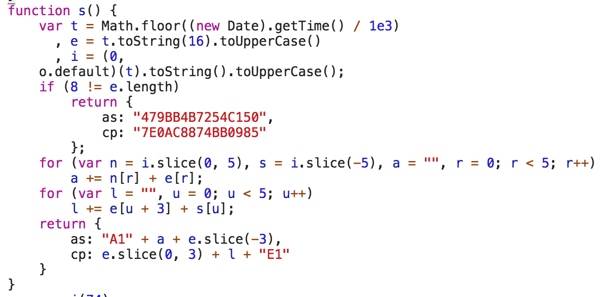

<h1 align="center">抖音 桌面版</h1>

## 特性

- **评论弹幕了解一下~**
- 支持本地收藏
- 支持视频下载
- 方向键 下：<kbd>↓</kbd> 切换视频

## 开发规划

- 收藏的视频支持评论弹幕
- 记录播放历史可以回溯

## 应用界面

## 下载

[Releases](https://github.com/lujqme/douyin/releases)

## 声明

UPDATE：因抖音接口策略调整，本应用不再向抖音 feed 接口发起模拟请求。

本应用<del>使用今日头条官网 web 端公开的相应参数算法(见下)，</del>未对抖音 APP 做逆向、分析、破解。

应用内的内容及视频版权归原作者以及抖音官方所有，本应用及其服务端不储存任何数据。

若本应用侵犯了您的权益，或造成不利影响，请联系 i@lujq.me，我将立即下架本应用。

## 参数算法（已失效）

具体 js 为：
https://s3.pstatp.com/toutiao/static/js/page/index_node/index.17e10acd0428d34edbef.js

算法为：

Python 翻译版在知识星球

## 新采集策略

抖音修改接口加密参数之后的采集策略见知识星球。

## 致谢

感谢以下开源项目的开发者：

- axios
- dplayer
- electron
- electron-builder
- electron-localshortcut
- mdui
- nedb

## 源代码授权

遵循 MIT 授权

## Python 数据交流

  
微信公众号(免费)

  
微信公众号：<code>pydatame</code>

  
只发网上找不到的高质量原创内容，绝不会给你 N 个 T 的网盘资料。扫描二维码关注：

  

 

  
微信 Python 数据交流群(免费)

  
不定期免费直播做技术分享，之前免费分享过的内容：

  <ul>
    <li>淘宝基于协议的模拟登录</li>
    <li>京东基于协议的下单流程模拟</li>
    <li>微博基于协议的模拟登录</li>
    <li>百度基于协议的模拟登录</li>
    <li>豆瓣基于协议的模拟登录以及自动顶帖</li>
    <li>搜狐基于协议的模拟登录以及视频上传</li>
  </ul>
  
一群 500 人已满。二群 300 人，备注来意加我微信，微信号可从公众号获取。

 

  
微信付费交流群(<code>200元</code>/永久)

  <ul>
    <li>有我的朋友们，其中有在读牛津大学、香港大学、香港中文大学、清华大学等高校数学、计算机以及金融专业的博士，也有业界腾讯、小米、百度、今日头条各岗位的工程师，提供交流提问机会。</li>
    <li>超高频信息流，涵盖各领域内容。</li>
    <li>群友免费提供的各种资源，比如：微软企业用户帐号（免费 ofiice 系列、onedrive 大容量、outlook 企业邮箱等），EDU 邮箱接收学生专属福利，提供共享 VPS 做开发、测试，超低价商品优惠信息线报，京东免邮券，不定时大额现金红包。</li>
    <li>Python、数据抓取、数据分析、数据挖掘、大数据相关问题迅速解答。</li>
  </ul>

 

  
知识星球：数据(<code>199元</code>/年)

  
星主做过：

  <ul>
    <li>淘宝、京东、支付宝、微博、百度、豆瓣、搜狐等各网站基于 HTTP/S 协议的模拟登录实现视频讲解以及代码实现
    <li>支付宝个人支付回调实现</li>
    <li>基于 HTTP/S 协议的京东下单全流程实现，秒杀场景应用</li>
    <li>每天上亿次数据规模超 TB 级的数据抓取架构设计</li>
    <li>PB 数据量的数据仓库搭建以及维护</li>
    <li>HiveQL 海量数据分析经验</li>
  </ul>
  
部分内容已在星球分享，此外星球还有的内容：

  <ul>
    <li>大规模分布式数据抓取架构详解</li>
    <li>12306 抢票代码实现</li>
    <li>豆瓣自动顶帖视频讲解及代码实现</li>
    <li>抖音及今日头条推荐接口参数的 Python 版模拟实现</li>
    <li>数据挖掘算法讲解</li>
    <li>数据可视化实例</li>
    <li>优秀开源工具、框架及库推荐及使用说明</li>
  </ul>
  
扫码加入`数据`星球：

  

