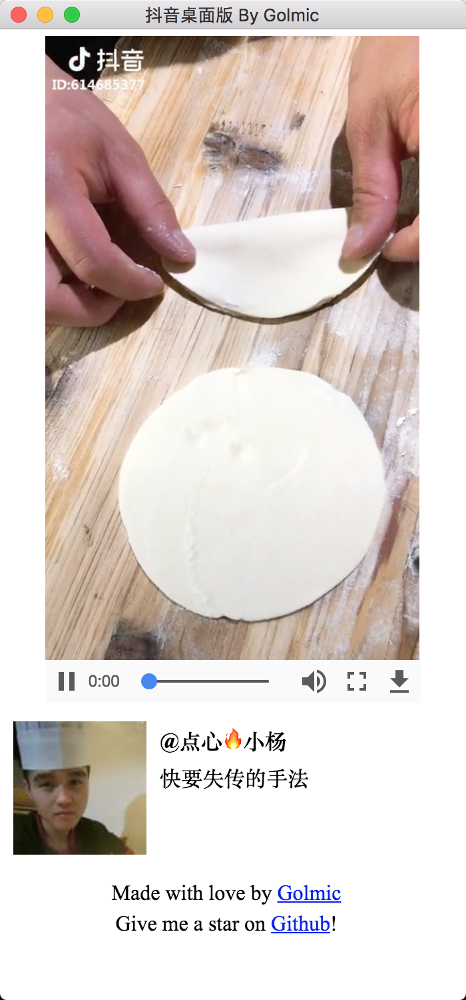

# 抖音 桌面版

## 应用界面

## 下载

- Github Releases：
  [releases 页面](https://github.com/lujqme/douyin/releases)下载相应系统对应版本
- 服务器分发：[Windows](https://dl.lujianqiang.com/DouYin-win32-x64.zip) | [Linux](https://dl.lujianqiang.com/DouYin-linux-x64.zip) | [mac OS](https://dl.lujianqiang.com/DouYin-darwin-x64.zip)

## 使用

方向键 下：<kbd>↓</kbd>

## 声明

内容版权归原作者以及抖音官方所有，本应用及其服务端不储存任何数据。

若本应用侵犯了您的权益，或造成不利影响，请联系 i@lujq.me，我将立即下架本应用。

## 源代码授权

遵循 MIT 授权
